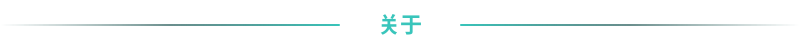
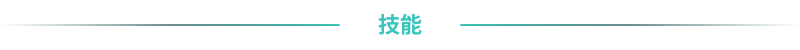
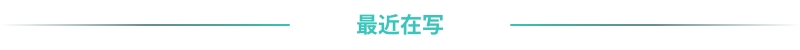
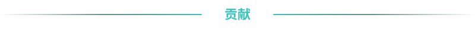

  
  

  
  
  
  

 

  

  主要方向：<b>Web 安全</b> | <b>内网渗透</b> | <b>权限提升</b> | <b>代码审计</b> 
  <b>红队</b> | <b>蓝队</b> 实战经历 
  <a href="https://wh1tZz5.github.io">个人博客</a> | <a href="https://blog.csdn.net/qq_74182308">CSDN</a>

 

  

<b>渗透与漏洞</b>

  
  
  
  
  
  

<b>工具</b>

  
  
  
  
  
  
  
  
  

<b>语言与基础设施</b>

  
  
  
  
  
  
  
  

<b>安全运营与防御</b>

  
  
  
  
  

 

  

  <a href="https://blog.csdn.net/qq_74182308/article/details/157296727">Day02-计算机网络基础</a> <code>2026-01-23</code> 
  <a href="https://blog.csdn.net/qq_74182308/article/details/157296147">Day01-计算机应用基础</a> <code>2026-01-23</code>

 

  

  <picture>
    <source media="(prefers-color-scheme: dark)" srcset="https://raw.githubusercontent.com/wh1tZz5/wh1tZz5/output/github-contribution-grid-snake-dark.svg">
    <source media="(prefers-color-scheme: light)" srcset="https://raw.githubusercontent.com/wh1tZz5/wh1tZz5/output/github-contribution-grid-snake.svg">
    
  </picture>

 

— 保持好奇，保持热爱 —

