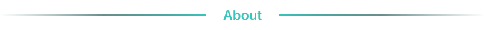
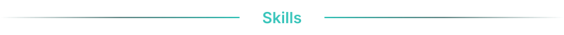
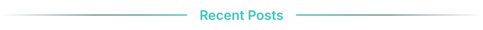
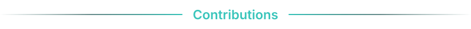

  <a href="README.md">简体中文</a> | <b>English</b>

  
  

  
  
  
  

 

  

  Main Focus: <b>Web Security</b> | <b>Internal Network Pentest</b> | <b>Privilege Escalation</b> | <b>Code Audit</b> 
  <b>Red Team</b> | <b>Blue Team</b> hands-on experience 
  <a href="https://wh1tZz5.github.io">Personal Blog</a> | <a href="https://blog.csdn.net/qq_74182308">CSDN</a>

 

  

<b>Penetration & Vulnerabilities</b>

  
  
  
  
  
  

<b>Tools</b>

  
  
  
  
  
  
  
  
  

<b>Languages & Infrastructure</b>

  
  
  
  
  
  
  
  

<b>Security Operations & Defense</b>

  
  
  
  
  

 

  

  <a href="https://blog.csdn.net/qq_74182308/article/details/157296727">Day02-Computer Networking Basics</a> <code>2026-01-23</code> 
  <a href="https://blog.csdn.net/qq_74182308/article/details/157296147">Day01-Computer Fundamentals</a> <code>2026-01-23</code>

 

  

  <picture>
    <source media="(prefers-color-scheme: dark)" srcset="https://raw.githubusercontent.com/wh1tZz5/wh1tZz5/output/github-contribution-grid-snake-dark.svg">
    <source media="(prefers-color-scheme: light)" srcset="https://raw.githubusercontent.com/wh1tZz5/wh1tZz5/output/github-contribution-grid-snake.svg">
    
  </picture>

 

— Stay curious, stay passionate —
